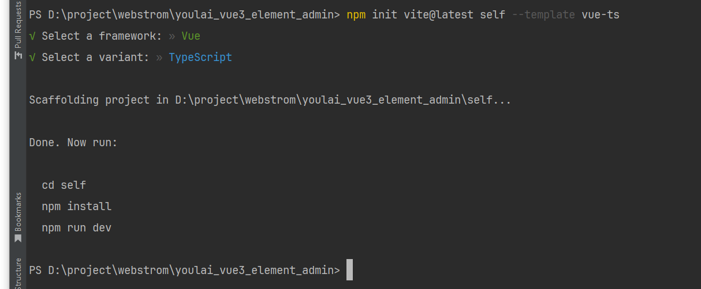
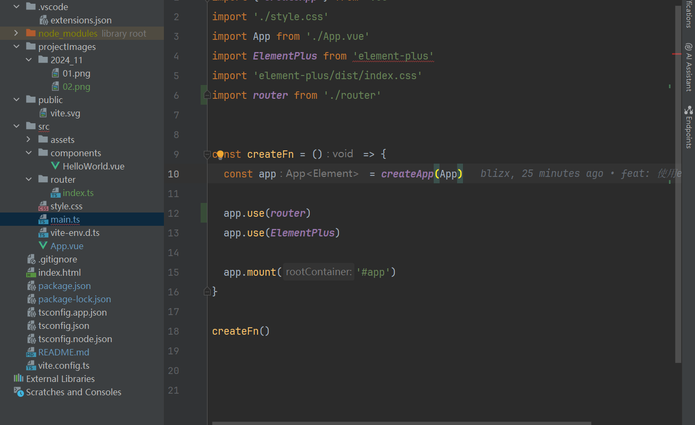
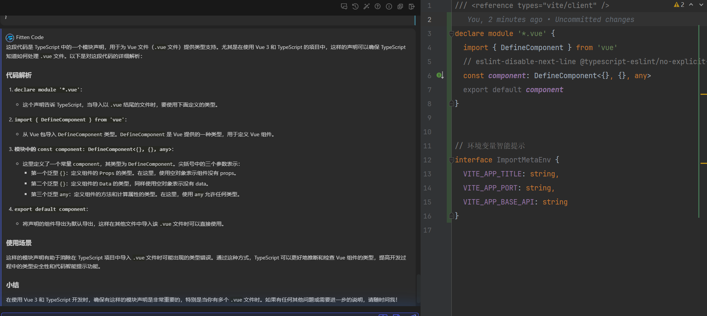
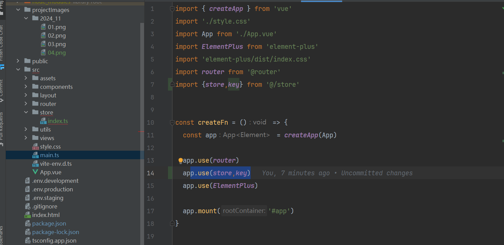
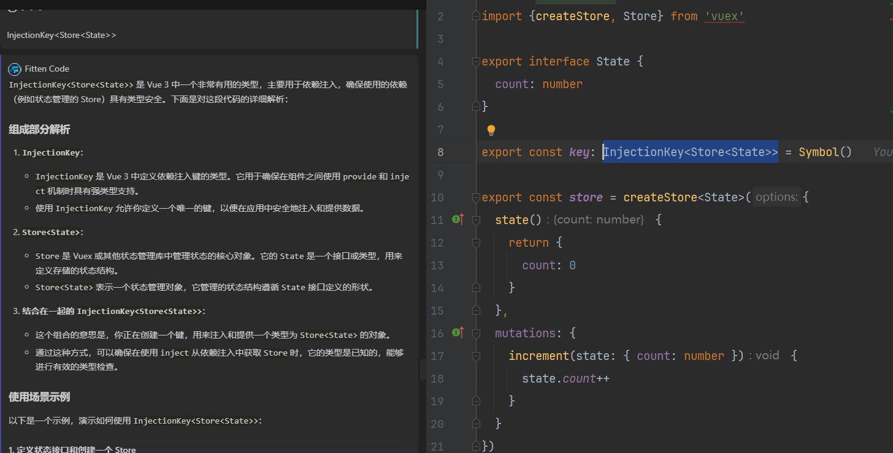

# Vue 3 + TypeScript + Vite

This template should help get you started developing with Vue 3 and TypeScript in Vite. The template uses Vue 3 `<script setup>` SFCs, check out the [script setup docs](https://v3.vuejs.org/api/sfc-script-setup.html#sfc-script-setup) to learn more.

Learn more about the recommended Project Setup and IDE Support in the [Vue Docs TypeScript Guide](https://vuejs.org/guide/typescript/overview.html#project-setup).

# 1 项目介绍

本项目是一个使用 Vue 3 + TypeScript + Vite 的项目模板，旨在帮助开发者快速上手 Vue 3 和 TypeScript。

## 1.1  参考链接
1 [Vue3.3 + Vite+ Element-Plus + TypeScript 从0到1搭建企业级后台管理系统（前后端开源）](https://juejin.cn/post/7228990409909108793)   
2 原来仓库地址[地址](https://github.com/youlaitech/vue3-element-admin.git)  

## 1.2 项目搭建

### 1.2.1 项目初始化  
``` bash
# 初始化项目
npm init vite@latest self --template vue-ts
```


``` bash
# 初始化git仓库
git init

# 绑定远程仓库
git remote add origin 仓库地址
```    

``` bash

# 安装依赖
npm install

# 启动项目
npm run dev
```

### 1.2.2 使用element-plus 
``` bash
# 安装依赖
 npm install element-plus --save
```

``` typescript
 // 全局引入 修改main.ts
import { createApp } from 'vue'
import './style.css'
import App from './App.vue'
import ElementPlus from 'element-plus'
import 'element-plus/dist/index.css'


const createFn = () => {
  const app = createApp(App)

  app.use(ElementPlus)

  app.mount('#app')
}

createFn()
```

### 1.2.3 使用vue-router 
``` bash
# 安装依赖
 npm install vue-router@4
```

``` typescript
 // 定义 src/router/index.ts
 import {createRouter, createWebHashHistory} from 'vue-router';
import HelloWorld  from '../components/HelloWorld.vue';

const router = createRouter({
  history: createWebHashHistory(),
  routes: [
    {
      path: '/',
      redirect: '/home'
    },
    {
      path: '/home',
      name: 'Home',
      component: HelloWorld
    },
  ]
})

export default router
```
  

### 1.2.4 路径别名@   
 1 下载依赖    
 在 ts 模块中加载 node 核心模块需要安装 node 的类型补充模块: npm i -D @types/node
```bash  
npm i -D @types/node
```  
2 在 tsconfig.json 文件中配置路径别名  


```json
{
 "compilerOptions": {
  /*Vite 路径别名报错*/
  "baseUrl": "./",
  "paths" : {
   "@": ["src"],
   "@/*": ["src/*"],
   "@router/*": ["src/router/*"]
  }
 },
 "include": ["src/**/*.ts", "src/**/*.d.ts", "src/**/*.tsx", "src/**/*.vue"]
}

```

3 在 vite.config.ts配置 
```typescript
import { defineConfig } from 'vite'
import vue from '@vitejs/plugin-vue'
import path from 'path'  // 在 ts 模块中加载 node 核心模块需要安装 node 的类型补充模块: npm i -D @types/node

// https://vite.dev/config/
export default defineConfig({
  plugins: [vue()],
  resolve: {
    // Vite2设置别名路径方式一
/*    alias: {
      "@": path.resolve( "./src")
    }*/
    alias: [
        {
          find: '@',
          replacement: path.resolve( './src')
        },
      {
        find: '@router',
        replacement: path.resolve( './src/router')
      },
    ]
  }
})

```

### 1.2.5 多环境配置
1 配置环境变量文件.env.development 和.env.production等  
2 在 package.json中配置脚本命令 
```json
  "scripts": {
    "dev": "vite serve --mode development",
    "build:prod": "vue-tsc --noEmit && vite build --mode production",
    "preview": "vite preview"
  },
```   

### 1.2.6 封装axios网络请求模块  
``` bash
# 安装依赖
 npm install axios
```
1 src/utils/request.ts 文件编写
```typescript
/**
 * @description axios请求模块
 * */
import axios from 'axios';
import {Session} from '@utils/storage.ts';
import {ElMessage, ElMessageBox} from 'element-plus';

/**
 * @description 创建 axios 实例
 * @description Content-Type: Content-Type 是一个HTTP头字段，用于指示
 *        传输内容的媒体类型。它告诉接收方如何处理传输的内容，比如是文本、图像，还是其他类型的数据。
 * */
const service = axios.create({
  baseURL: import.meta.env.VITE_BASE_API,
  timeout: 50000, // 请求超时时间
  headers: {"Content-Type": "application/json;charset=utf-8"},
})

/**
 * @description 请求拦截器
 * */
service.interceptors.request.use(
    (config) => {
  if(!config.headers) {
    throw new Error(`Expected 'config' and 'config.headers' not to be undefined`);
  }
  if(Session.get('token')) {
    config.headers.Authorization = `${Session.get('token')}`;
  }
  return config
},
    (error) => {
  return Promise.reject(error)
})

/**
 * @description 响应拦截器
 * */
service.interceptors.response.use(({data})=>{
  // 对响应数据做点什么
  const {code, msg} = data;
  if (code === '00000') {
    return data;
  } else {
    ElMessage({
      message: msg || '系统出错',
      type: 'error'
    })
    return Promise.reject(new Error(msg || 'Error'))
  }
}, (error) => {
  const {code, msg} = error.response.data
  if (code === 'A0230') {  // token 过期
    Session.clear(); // 清除浏览器全部临时缓存
    window.location.href = '/'; // 跳转登录页
    ElMessageBox.alert('当前页面已失效，请重新登录', '提示', {})
        .then(() => {
        })
        .catch(() => {
        });
  }
  return Promise.reject(new Error(msg || 'Error'))
})

// 导出 axios 实例
export default service

```

### 1.2.7 修改多环境变量配置和添加智能提示

1 环境变量智能提示修改地址：src/vite-env.d.ts  
2 需要注意的是
  

### 1.2.8 使用vuex 
``` bash
# 安装依赖
 npm install vuex
```
```typescript
// 定义 src/store/index.ts
import {InjectionKey} from 'vue'
import {createStore, Store} from 'vuex'

export interface State {
 count: number
}

export const key: InjectionKey<Store<State>> = Symbol()

export const store = createStore<State>({
 state() {
  return {
   count: 0
  }
 },
 mutations: {
  increment(state: { count: number }) {
   state.count++
  }
 }
})
```
2 在 main.ts 中引入 store 并挂载到根实例上  
  

3 注意点：  
 